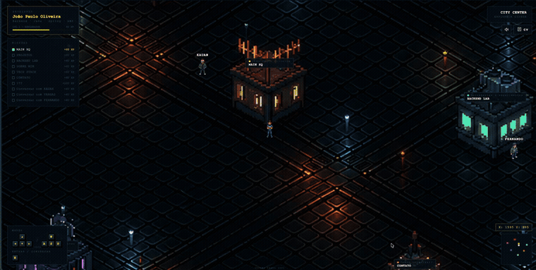

 

### 👋 Sobre mim

Backend Developer com **3 anos de experiência**, atualmente atuando como **Desenvolvedor de Software Pleno** na **Segala's Alimentos**, construindo soluções escaláveis com **Java & Spring Boot** e infraestrutura em nuvem com **AWS/Terraform**.

**[🎮 jopes-rpg](https://jopes-rpg.vercel.app)** · **[🌐 jopes.com.br](https://www.jopes.com.br/en)**

  

 

### 📌 Projeto em destaque

  

  🎮 <a href="https://github.com/JoaoOliveira07/jopes-rpg"><strong>jopes-rpg</strong></a> — portfolio de backend engineer em forma de cidade isométrica navegável · <a href="https://jopes-rpg.vercel.app">jogar agora</a>

 

### 🛠️ Tech Stack

  
  
  
  
  
  
  
  
  
  
  
  
  
  
  
  
  
  
  
  
  
  
  
  
  
  
  
  
  
  
  

 

### 📎 Outros projetos

| Projeto | Descrição |
|---|---|
| 💰 [**finance-dashboard**](https://github.com/JoaoOliveira07/finance-dashboard) | API backend em Java para gestão financeira pessoal |
| 🖥️ [**finance-dashboard-frontend**](https://github.com/JoaoOliveira07/finance-dashboard-frontend) | Frontend do finance-dashboard |
| 📄 [**document-validation-poc**](https://github.com/JoaoOliveira07/document-validation-poc) | Prova de conceito de validação automatizada de documentos |
| ⏱️ [**commitclock**](https://github.com/JoaoOliveira07/commitclock) | Ferramenta para acompanhar hábitos de commit no GitHub |
| 🌐 [**portfolio-joao**](https://github.com/JoaoOliveira07/portfolio-joao) | Site pessoal de portfólio |

 

### 📊 Contribuições

<picture data-importer="pacman">
  <source media="(prefers-color-scheme: dark)" srcset="https://raw.githubusercontent.com/JoaoOliveira07/JoaoOliveira07/output/pacman-contribution-graph-dark.svg">
  <source media="(prefers-color-scheme: light)" srcset="https://raw.githubusercontent.com/JoaoOliveira07/JoaoOliveira07/output/pacman-contribution-graph.svg">
  
</picture>

 

### 📫 Contato

Vamos trocar uma ideia? Me encontre por aqui:

  

